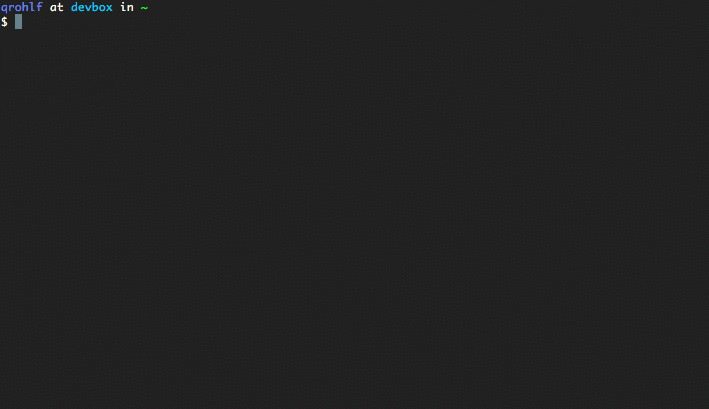

# Lair is your own personal PaaS



Lair is a Platform as a Service provider that you can install with a single command through the magic of Vagrant and Puppet. 

It's powered by [Dokku](https://github.com/progrium/dokku), so deploying applications becomes as simple as `git push`. It even includes a realtime activity monitor, so you can see what's going on under the hood from the comfort of your browser.

Basically, Lair is the fastest way to get a Heroku-like development environment up and running.

# Installation

There are three ways to install Lair:

- You can use the `bootstrap.sh` script to install Lair on a server with a single command
- You can install Lair locally with Vagrant to try it out without needing a server, or to test your apps on your local machine
- You can install Lair manually using puppet-apply

Each of these methods is explained below

## Installing on a Server with bootstrap.sh
Before installing Lair on your server, make sure your server environment is supported. Lair is built and tested using an Ubuntu 12.04.4 x64 DigitalOcean Droplet, but it should work on any server provided you're running a fresh copy of Ubuntu 13.04 or 12.04 x64 (13.10 is **not** supported due to a known issue with docker).

```bash
DOMAIN='yourdomain.com' wget -qO- https://raw.github.com/qrohlf/lair/master/bootstrap.sh | sudo bash
```

```bash
cat ~/.ssh/id_rsa.pub |ssh you@yourserver.com "sudo sshcommand acl-add dokku '$USER@$HOSTNAME'"
```

## Installing Locally with Vagrant
First, make sure you have [Vagrant](http://www.vagrantup.com/downloads.html) and [Virtualbox](https://www.virtualbox.org/wiki/Downloads) installed on your machine.

Add your ssh key to Dokku so that you can deploy apps via ssh:

```bash
cat ~/.ssh/id_rsa.pub |ssh -i ~/.vagrant.d/insecure_private_key -p 2222 vagrant@localhost "sudo sshcommand acl-add dokku '$USER@$HOSTNAME'"
```

## Installing Manually
Lair is really just a collection of Puppet scripts and modules, so it should be really easy to get it working on any machine that has puppet installed. 

Assuming you have Puppet already installed, all you need to do to get Lair up and running is:

```bash
export DOMAIN='yourdomain.com'
git clone https://github.com/qrohlf/lair
cd lair
./set-fqdn.sh $DOMAIN
FACTER_fqdn="$DOMAIN" puppet apply --modulepath modules --manifestdir manifests --detailed-exitcodes manifests/site.pp
```

# Credits
Lair is actually just a bundle that brings together several excellent tools into one environment. The following people and tools do most of the heavy lifting:

- [progrium/dokku](https://github.com/progrium/dokku) handles application building and deployment
- [scout/scout_realtime](https://github.com/scoutapp/scout_realtime) provides the nice activity monitor
- [Vagrant](http://www.vagrantup.com) handles VM creation and management
- [Puppet](https://puppetlabs.com) is the glue that holds it all together
- I also was inspired by [Vagrantpress](http://vagrantpress.org) and used their puppet scripts as a reference while I was writing some of the modules used in Lair.

# Contributing

Pull requests are welcome! Fork Lair on [Github](https://github.com/qrohlf/lair)